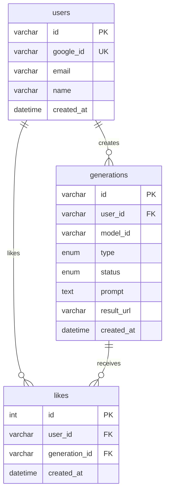

# Studio Wit

AI 이미지/비디오 생성 모델을 하나의 인터페이스로 통합한 미디어 생성 플랫폼.

Google Imagen, OpenAI GPT Image, fal.ai Flux 등 여러 AI 모델을 단일 API로 제공합니다.

---

## Tech Stack

### Frontend

| Category | Technology |
|---|---|
| Framework | Next.js 16 (App Router, Standalone) |
| Language | TypeScript 5 |
| UI | shadcn/ui + Tailwind CSS v4 |
| State | Zustand 5 |
| Auth | NextAuth v5 (Google OAuth) |
| i18n | next-intl (한국어 / English) |
| Theme | next-themes (Dark / Light) |

### Backend

| Category | Technology |
|---|---|
| Framework | FastAPI |
| ORM | SQLAlchemy 2.0 (async) |
| DB | SQLite (dev) / MySQL 8 (prod) |
| Auth | JWT (python-jose) + Google ID Token |
| Migration | Alembic |
| Admin | SQLAdmin (`/admin`) |
| Profiler | fastapi-profiler-lite (`/profiler`) |

### Infrastructure

| Category | Technology |
|---|---|
| Container | Docker (multi-stage) |
| Reverse Proxy | Nginx |
| Cloud | AWS EC2 + RDS |

---

## Supported AI Models

| Provider | Model | Type | Mode |
|---|---|---|---|
| Google | Imagen 4 | Image | Sync |
| Google | Veo 3 | Video | Async |
| OpenAI | GPT Image | Image | Sync |
| OpenAI | Sora 2 | Video | Async |
| fal.ai | Flux 2 Pro | Image | Async |
| fal.ai | Kling | Video | Async |

---

## Project Structure

```
studio-wit/
├── frontend/                  # Next.js 프론트엔드
│   ├── src/
│   │   ├── app/[locale]/      # i18n 라우팅 (ko, en)
│   │   ├── components/        # UI 컴포넌트
│   │   ├── services/          # API 클라이언트
│   │   ├── stores/            # Zustand 스토어
│   │   └── types/             # TypeScript 타입
│   ├── messages/              # 번역 파일 (ko.json, en.json)
│   ├── Dockerfile
│   └── nginx.conf
│
├── backend/                   # FastAPI 백엔드
│   ├── app/
│   │   ├── api/               # 라우터 (auth, models, generation, gallery)
│   │   ├── models/            # ORM 모델 + Pydantic 스키마
│   │   ├── services/          # 비즈니스 로직
│   │   │   └── providers/     # AI 프로바이더 (Google, OpenAI, fal.ai)
│   │   ├── core/              # 예외, 미들웨어
│   │   ├── admin.py           # SQLAdmin 설정
│   │   └── main.py            # 앱 진입점
│   ├── Dockerfile
│   └── requirements.txt
│
└── docs/
    ├── api-schema.md          # REST API 명세
    └── schema.dbml            # DB ER 다이어그램 (dbdiagram.io)
```

---

## Getting Started

### Prerequisites

- Node.js 22+
- Python 3.9+
- Yarn (Corepack)

### Frontend

```bash
cd frontend
corepack enable
yarn install
yarn dev                       # http://localhost:3000
```

### Backend

```bash
cd backend
pip install -r requirements.txt
uvicorn app.main:app --reload  # http://localhost:8000
```

### Environment Variables

**Frontend** (`.env.local`):

```env
NEXT_PUBLIC_APP_NAME=Wit
NEXT_PUBLIC_APP_URL=http://localhost:3000
NEXT_PUBLIC_API_URL=http://localhost:8000
AUTH_SECRET=<base64-secret>
GOOGLE_CLIENT_ID=<google-client-id>
GOOGLE_CLIENT_SECRET=<google-client-secret>
```

**Backend** (`.env`):

```env
DATABASE_URL=sqlite+aiosqlite:///./wit.db
JWT_SECRET=<jwt-secret>
GOOGLE_CLIENT_ID=<google-client-id>
GOOGLE_AI_API_KEY=<google-ai-api-key>
OPENAI_API_KEY=<openai-api-key>
FAL_API_KEY=<fal-api-key>
CORS_ORIGINS=["http://localhost:3000"]
```

---

## API Endpoints

| Method | URI | Auth | Description |
|---|---|---|---|
| `POST` | `/api/auth/verify` | - | Google 토큰 검증 + JWT 발급 |
| `GET` | `/api/models` | JWT | 사용 가능한 AI 모델 목록 |
| `POST` | `/api/generate` | JWT | 생성 작업 요청 (202) |
| `GET` | `/api/generation/{id}` | JWT | 생성 상태 폴링 |
| `GET` | `/api/generations` | JWT | 내 생성 이력 (커서 페이지네이션) |
| `GET` | `/api/gallery` | - | 공개 갤러리 |
| `POST` | `/api/gallery/{id}/like` | JWT | 좋아요 토글 |

자세한 명세는 [`docs/api-schema.md`](docs/api-schema.md) 참고.

---

## Dev Tools

서버 실행 후 사용 가능한 개발 도구:

| Tool | URL | Description |
|---|---|---|
| Swagger UI | `/docs` | API 인터랙티브 테스트 |
| ReDoc | `/redoc` | API 문서 뷰어 |
| SQLAdmin | `/admin` | DB 관리 UI (CRUD) |
| Profiler | `/profiler` | 엔드포인트 성능 대시보드 |

---

## Database



DBML 파일: [`docs/schema.dbml`](docs/schema.dbml) (dbdiagram.io에 붙여넣기)

---

## Generation Flow

```
Client                    Backend                   AI Provider
  │                         │                           │
  ├── POST /api/generate ──▶│                           │
  │                         ├── DB insert (pending) ──▶ │
  │◀── 202 {id} ───────────┤                           │
  │                         ├── BackgroundTask ────────▶│
  │                         │     (call provider API)   │
  │── GET /generation/{id} ▶│                           │
  │◀── {status: processing} │                           │
  │                         │◀── result ────────────────┤
  │── GET /generation/{id} ▶│                           │
  │◀── {status: completed,  │                           │
  │     result_url: "..."}  │                           │
```

---

## Scripts

### Frontend

```bash
yarn dev              # 개발 서버
yarn build            # 프로덕션 빌드
yarn lint             # ESLint
yarn format           # Prettier 포맷
```

### Backend

```bash
uvicorn app.main:app --reload             # 개발 서버
alembic upgrade head                       # 마이그레이션 적용
alembic revision --autogenerate -m "msg"   # 마이그레이션 생성
```

---

## Docker

```bash
# Frontend
docker build -t wit-frontend ./frontend
docker run -p 3000:3000 wit-frontend

# Backend
docker build -t wit-backend ./backend
docker run -p 8000:8000 wit-backend
```
